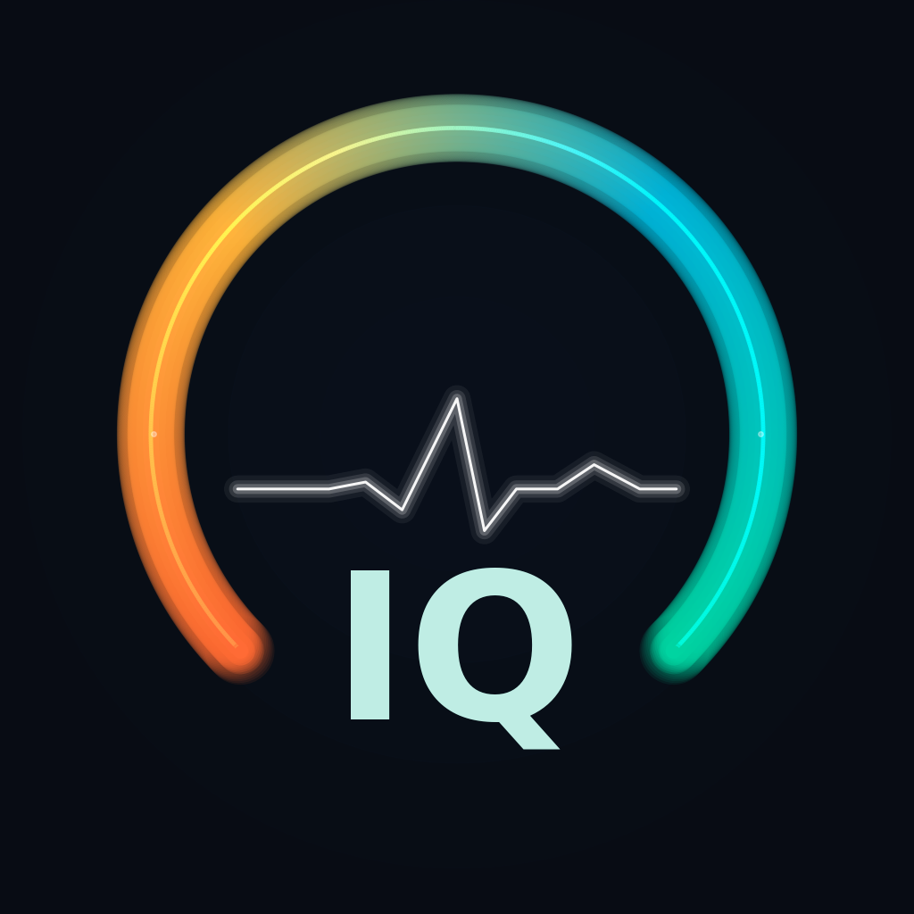
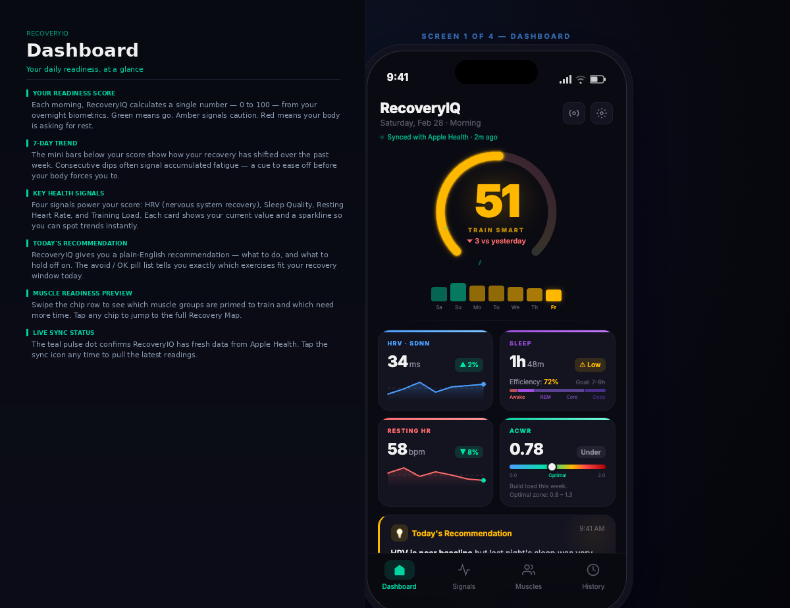
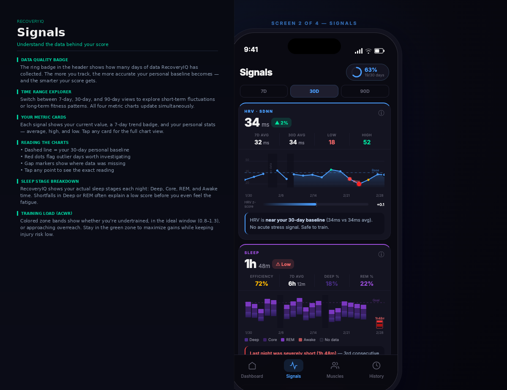
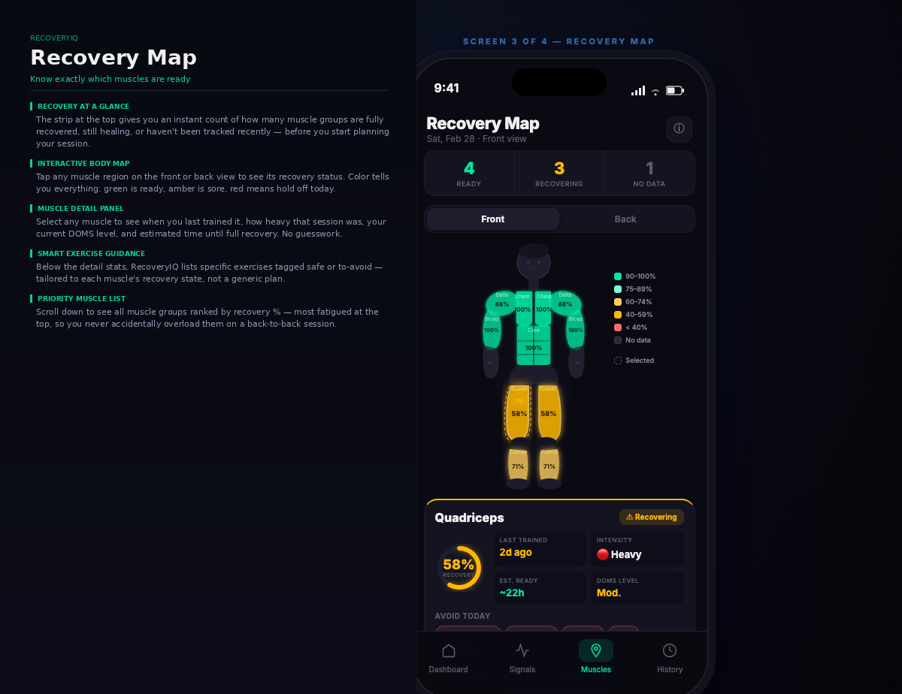
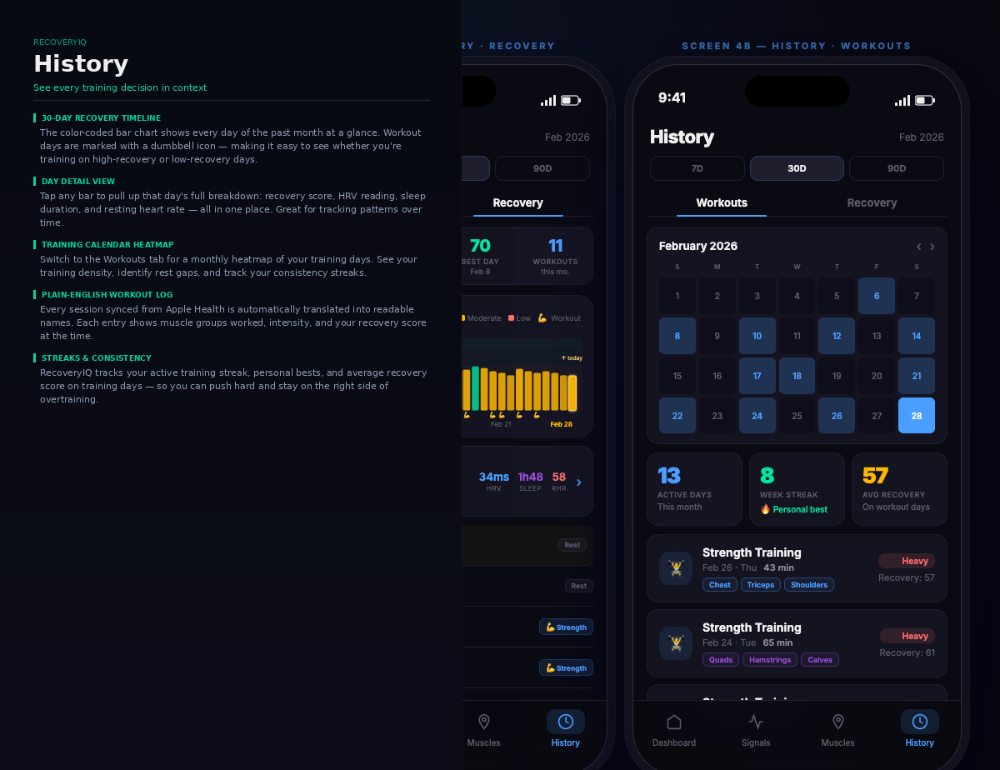

 ---
layout: default
---

  

  # RecoveryIQ

  **Coming Soon to the App Store!**

  
  

 

RecoveryIQ is an advanced iOS application designed for dedicated lifters, bodybuilders, and athletes who want to optimize their training based on their body's actual physiological readiness. By integrating seamlessly with Apple HealthKit, the app translates raw biometric data—such as Heart Rate Variability (HRV), Resting Heart Rate (RHR), and Sleep Quality—into actionable insights.

## Features

### Daily Readiness Score

Stop guessing if you've fully recovered. RecoveryIQ processes your overnight biometrics to calculate a daily Readiness Score (0-100), accompanied by intelligent guidance on whether you should push hard, focus on lighter work, or prioritize rest. The app also tracks your Acute:Chronic Workload Ratio (ACWR) to warn you if you're over-training.

### Intelligent Muscle Tracking

Unlike standard fitness apps, RecoveryIQ tracks fatigue at the individual muscle group level. Log your workouts and the app's advanced DOMS (Delayed Onset Muscle Soreness) decay model will visually display which muscles are fully recovered, moderately fatigued, or need more rest. Get specific recommendations on which exercises to avoid based on your localized fatigue.

### Comprehensive History & Trends

Analyze your progress over time with detailed 30-day and 90-day trend charts. Cross-reference your physiological readiness scores against your logged workout intensity to discover your optimal training conditions. Learn exactly how many consecutive training days your body can handle before performance drops.

## How it Works (The User Journey)

### 1. Morning Check-In
Upon waking, open the app. The app automatically pulls your overnight sleep and HRV data from your Apple Watch. Your dashboard instantly shows your Readiness Score and a daily tip advising you on your target training intensity for the day.

### 2. Pre-Workout Review
Before hitting the gym, check the **Muscles** tab. A full-body heat map shows the recovery status of 18 distinct muscle groups. If your quads are glowing red from yesterday's heavy squats, the app might suggest pivoting from a full lower-body day to focusing on a different muscle group.

### 3. Log Your Session
After training, quickly log your session. Select the specific muscles you targeted, your Rate of Perceived Exertion (RPE), and any top sets. Your PRs are tracked, and the muscle fatigue model is updated instantly.

### 4. Continuous Learning
Over time, the app learns your personal baseline. It detects patterns, warning you if you are consistently training on low-readiness days, and adjusting its recommendations to fit your unique recovery curve.

## Key Metrics Explained

To get the most out of RecoveryIQ, it's helpful to understand the core metrics it tracks and why they matter for your training:

*   **Readiness Score (0-100):** A composite score reflecting your overall physiological state for the day. A score above 75 means you're primed for a hard workout. A score below 60 suggests you should prioritize active recovery or rest. It's calculated using your overnight HRV, Resting Heart Rate, and Sleep Quality.
*   **Heart Rate Variability (HRV):** The variation in time between each heartbeat. A higher HRV generally indicates that your autonomic nervous system is recovered and ready to handle stress (like a heavy lifting session). RecoveryIQ tracks your HRV relative to your personal 7-day baseline.
*   **Resting Heart Rate (RHR):** The number of times your heart beats per minute while at complete rest. An unusually high RHR can be an early sign of an impending illness, poor sleep, or incomplete cardiovascular recovery.
*   **Acute:Chronic Workload Ratio (ACWR):** A measure of your training load balance. It compares your recent training intensity (acute) to your historical training intensity (chronic). An ACWR between 0.8 and 1.3 is the "sweet spot." An ACWR over 1.5 indicates a high risk of overtraining or injury.
*   **Delayed Onset Muscle Soreness (DOMS) Estimate:** Not just how sore you *feel*, but a mathematical decay model of how fatigued a specific muscle group is based on the intensity of your last workout and how much time has passed since. If a muscle's DOMS estimate is over 70%, it will glow red on the body map, indicating it needs more rest before direct training.
